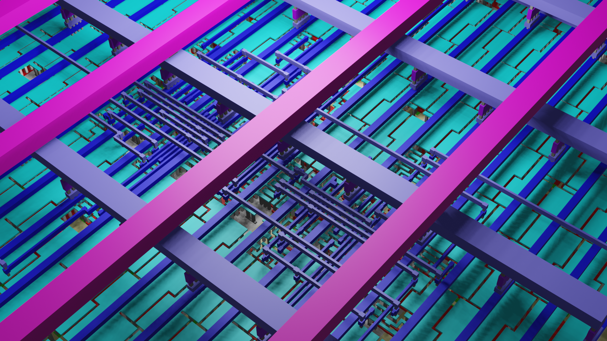

This version of gdsiistl is adapted to work with the GDS files generated for the SkyWater SKY130 PDK

Basically the `datatype` was added to be able to identify the different layers.
It also includes in the process some of the more common SDK130 layers (nwell, diff, poly, li1, etc) 

Here's a reference of the SKY130 GDS layer/datatype ids in case you need to add other layers to the process:
https://skywater-pdk.readthedocs.io/en/main/rules/layers.html#gds-layers-information



Original gdsiistl README file:

# gdsiistl

Converts GDSII files to STL files.

GDSII files are often large, complex 2D designs for integrated circuits and MEMS chips. 3D visualization of the designs can be very useful, but this is tricky due to the complexity of the files. This is a simple script that extrudes selected layers of the GDSII files into 3D and outputs them as separate 3D STL files for visualization in an external program.

# Installation

Install git and Python 3 and its package manager (`pip`), then install:

```
pip install numpy
pip install gdspy
pip install numpy-stl
pip install triangle
```

The modules `gdspy` and `triangle` compile C libraries, which may cause trouble on Windows; it might require you to first install Microsoft Visual C++ Build Tools (e.g., from https://visualstudio.microsoft.com/downloads).

Finally:

```
git clone https://github.com/mbalestrini/gdsiistl
```

# Usage

Suppose you have a GDSII file called `file.gds` that is to be converted to a 3D STL format.

First, choose GDSII layers to export and their thicknesses by editing `gdsiistl.py`, specifically, by entering the desired GDSII layer numbers and z bounds in the `layerstack` variable around line 35.

Second, run `python3 gdsiistl.py file.gds`. The file will be processed and output files written to `file.gds_layername1.stl`, `file.gds_layername2.stl`, etc.

Concretely:

```
cd gdsiistl
python gdsiistl.py example/example.gds
# output files are example/example.gds_substrate.stl, etc.
```

Many programs are capable of viewing the output STL files. Blender (https://www.blender.org/) can import STL files, apply materials, and render very impressive visualizations.

## Note

Due to a limitation of the library used to triangulate the polygonal boundaries of the GDSII geometry, the polygon borders (i.e., all geometry) are shifted slightly (by a hardcoded delta of about 0.01 units, or 10 nanometers in standard micron units) before export. Furthermore, due to another related limitation/bug (not yet completely understood; see source code comments), extra triangles are sometimes created covering holes in polygons.

So the output mesh is not guaranteed to be watertight, perfectly dimensioned, or retain all polygon holes, but it should be arbitrarily close and err on the side of extra triangles, so a program (e.g., Blender) can edit the mesh by deleting faces and produce a negligibly-far-from perfect visualization.


